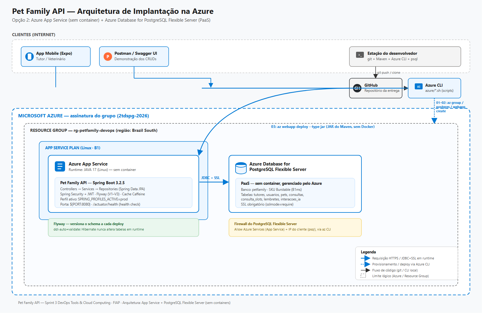

# Pet Family API

> Backend RESTful para acompanhamento contínuo da saúde dos pets
> **Challenge CLYVO VET 2026 — FIAP | Java Advanced — Entrega 3**
> **+ Sprint 3 — DevOps Tools & Cloud Computing (implantação na Azure)**

---

## Problema

Tutores de pets enfrentam dificuldades para manter a continuidade no cuidado veterinário: esquecem vacinas, perdem histórico de consultas, não possuem lembretes preventivos e não têm acesso fácil a orientações de saúde animal. O resultado é uma ruptura no cuidado que compromete o bem-estar dos animais.

## Solução

A Pet Family API centraliza e gerencia todas as informações relacionadas à saúde e ao bem-estar dos pets, com autenticação real e dois perfis de acesso:

- Autenticação por token (Bearer/JWT), com dois perfis: **TUTOR** e **VETERINARIO**
- Cadastro de tutores e múltiplos pets por tutor, com dados clínicos completos
- **Agendamento, cancelamento e atendimento de consultas** — fluxo completo com controle de disponibilidade
- **Cuidados preventivos com recorrência automática** — definidos pelo veterinário, confirmados pelo tutor
- Assistente de IA simulado para orientações de saúde animal (histórico persistido)
- Dashboard clínico com KPIs em tempo real (acesso do veterinário)
- Versionamento de banco de dados com **Flyway**
- **Implantação na nuvem (Azure App Service + PostgreSQL PaaS)** — ver seção
  [Sprint 3 — DevOps Tools & Cloud Computing](#sprint-3--devops-tools--cloud-computing-azure)

### Benefícios para o negócio

- **Mais recorrência de consultas** — lembretes preventivos com recorrência automática
  trazem o tutor de volta à clínica sem depender de contato manual.
- **Acompanhamento preventivo real** — cuidados definidos pelo veterinário (vacinas,
  vermifugação, retornos) ficam rastreados por pet, não perdidos em papel ou memória.
- **Menos perda de histórico clínico** — todo atendimento, observação e cuidado fica
  centralizado e consultável por pet, mesmo trocando de tutor responsável no app.
- **Mais vínculo tutor–clínica** — assistente de orientação e histórico de interações
  mantêm o tutor engajado entre uma consulta e outra.
- **Organização da agenda clínica** — modelo de disponibilidade (`consulta_slots`)
  evita conflito de horário mesmo com múltiplos tutores agendando ao mesmo tempo.
- **Indicadores de negócio** — dashboard com KPIs (taxa de adesão preventiva, volume
  de consultas) dá visibilidade gerencial para a clínica.

---


## Entidades e Relacionamentos

```
Usuario (TUTOR|VETERINARIO) ──(0..1)── Tutor (1) ────── (N) Pet
                                                              │
                                                              ├── (N) Consulta ── (0..1) ConsultaSlot
                                                              ├── (N) Lembrete (cuidado preventivo)
                                                              └── (N) InteracaoIA
```

| Entidade | Campos Principais |
|---|---|
| Usuario | id, nome, email, senhaHash, role, tutorId (nullable) |
| Tutor | id, nome, email, telefone |
| Pet | id, nome, especie, raca, idade, peso, observacoesSaude, tutorId |
| Consulta | id, data, horario, tipoConsulta, status, observacoes, petId |
| ConsultaSlot | id, data, horario (único), consultaId — modelo de disponibilidade |
| Lembrete | id, titulo, descricao, dataLembrete, tipo, status, recorrenciaDias, dataConclusao, criadoPor, concluidoPor, origemLembrete, petId |
| InteracaoIA | id, pergunta, resposta, dataHora, categoria, petId |

Um `Usuario` com role `TUTOR` está sempre vinculado 1:1 a um `Tutor` (criado junto no cadastro). Um `Usuario` com role `VETERINARIO` não tem `Tutor` associado — ele acessa dados clínicos de todos os pets.

---

## Segurança (Spring Security + JWT)

- Login com e-mail/senha (BCrypt), token **Bearer** com expiração (24h por padrão), assinatura HMAC-SHA256.
- **Sessão stateless** — sem cookie, sem `JSESSIONID`. CSRF fica desabilitado porque a proteção contra CSRF existe para o cenário "navegador envia cookie de sessão automaticamente"; como a API não usa cookie/sessão implícita, essa superfície de ataque não existe aqui.
- Cadastro público (`POST /auth/registrar`) sempre cria um usuário **TUTOR**. Não existe endpoint público para criar veterinário — a conta de demonstração é carregada pelo `DataInitializer` (perfil `dev`).
- **A identidade do tutor nunca vem do cliente.** Endpoints como `POST /pets` ignoram qualquer `tutorId` que venha no corpo; o tutor é sempre resolvido a partir do token (`SecurityUtils`/`UsuarioPrincipal`). Todo acesso a pet/consulta/cuidado é validado no service comparando o dono real com o tutor autenticado — inclusive quando o dado vem do cache (`@Cacheable`), a checagem de posse roda a cada chamada.
- Autorização por perfil com `@PreAuthorize` nos controllers + checagem de posse nos services (duas camadas).
- CORS liberado por variável de ambiente (`CORS_ALLOWED_ORIGINS`, padrão `*` em dev) — necessário porque o Expo roda em endereços variáveis (emulador, dispositivo físico, Expo Go).

### Variáveis de ambiente (sem segredos reais commitados)

| Variável | Padrão (dev) | Descrição |
|---|---|---|
| `JWT_SECRET` | *(fallback de dev embutido)* | Segredo HMAC do token. **Troque em qualquer ambiente real.** |
| `JWT_EXPIRATION_MS` | `86400000` (24h) | Validade do token. |
| `CORS_ALLOWED_ORIGINS` | `*` | Lista separada por vírgula em produção. |
| `SPRING_PROFILES_ACTIVE` | `dev` | Ver seção Flyway/dados de demonstração. |

Exemplo (PowerShell, para rodar com segredo customizado):
```powershell
$env:JWT_SECRET = "uma-chave-bem-grande-e-aleatoria-so-sua"
mvn spring-boot:run
```

---

## Flyway — versionamento de banco

O schema é 100% gerenciado pelo Flyway (`src/main/resources/db/migration`). O Hibernate roda com `ddl-auto=validate`: ele **nunca** cria ou altera tabelas em runtime, só confere se as entidades batem com o schema migrado.

| Migration | Conteúdo |
|---|---|
| `V1__schema_inicial.sql` | Tabelas base: tutores, pets, consultas, lembretes, interacoes_ia (equivalente ao schema das entregas 1–2). `pets.peso` usa `DOUBLE PRECISION` (padrão SQL, compatível com H2 e PostgreSQL). |
| `V2__autenticacao_e_fluxos.sql` | Tabela `usuarios` (autenticação), tabela `consulta_slots` (modelo de disponibilidade) e colunas novas em `lembretes` para o fluxo de cuidado preventivo (recorrência, conclusão, responsáveis). |

**Como criar uma nova migration:** adicione um arquivo `V3__descricao_curta.sql` em `src/main/resources/db/migration` (numeração sempre crescente) e rode a aplicação — o Flyway aplica automaticamente na subida. **Nunca edite uma migration já aplicada**; toda mudança de schema vira uma migration nova.

### Banco de dados por perfil

| Perfil | Banco | Arquivo de configuração |
|---|---|---|
| `dev` (padrão local) | H2 em **arquivo** (`./data/petfamily.mv.db`, ignorado pelo git) — dados persistem entre reinicializações. `AUTO_SERVER=TRUE` permite abrir o H2 Console com a aplicação já rodando. | `application-dev.properties` |
| `test` | H2 em **memória**, isolado — cada execução de teste começa de um banco limpo, migrado do zero. | `src/test/resources/application-test.properties` |
| `prod` (Azure) | **PostgreSQL** — Azure Database for PostgreSQL Flexible Server, conexão só por variável de ambiente, SSL obrigatório (`sslmode=require`). Nunca usa H2. | `application-prod.properties` |

Em qualquer perfil, `spring.jpa.hibernate.ddl-auto=validate` — o Hibernate **nunca**
cria/altera tabelas em runtime; só o Flyway evolui o schema. Ver seção
[Sprint 3 — DevOps Tools & Cloud Computing](#sprint-3--devops-tools--cloud-computing-azure)
para o passo a passo completo do deploy em PostgreSQL/Azure.

> **Nota:** o H2 dos perfis `dev`/`test` existe só para desenvolvimento local e para os
> testes automatizados (`mvn test`) rodarem isolados e rápidos, sem depender de rede —
> prática padrão de mercado. **A aplicação publicada na Azure (perfil `prod`) usa
> exclusivamente PostgreSQL — nunca H2.** O requisito "banco de dados em nuvem" desta
> entrega é atendido 100% pelo Azure Database for PostgreSQL Flexible Server.

### Dados de demonstração

O `DataInitializer` roda **apenas no perfil `dev`** (`spring.profiles.active` já é `dev` por padrão em `application.properties`) e é idempotente: só popula dados se o banco estiver vazio. Para subir sem dados fictícios (ex.: simular "produção"), rode com outro perfil:
```bash
SPRING_PROFILES_ACTIVE=prod mvn spring-boot:run
```

---

## Fluxos de negócio (além do CRUD)

### 1. Agendamento e atendimento de consultas

1. Tutor autenticado escolhe um **pet próprio**, tipo de consulta, data e horário (`POST /consultas/agendar`).
2. Backend valida: pet pertence ao tutor, data/horário no futuro, horário livre.
3. Disponibilidade é garantida por um **modelo de slot** (`consulta_slots`, `UNIQUE(data, horario)`) — a checagem de conflito é atômica no banco, então duas requisições concorrentes para o mesmo horário nunca conseguem reservar as duas.
4. Consulta nasce `AGENDADA`.
5. Veterinário registra o atendimento (`POST /consultas/{id}/realizar`) → `REALIZADA`. Transição feita com `UPDATE ... WHERE status = 'AGENDADA'` (compare-and-swap no banco), então uma segunda tentativa de "realizar" a mesma consulta é rejeitada com 409, mesmo sob concorrência.
6. Cancelamento (`POST /consultas/{id}/cancelar`) só é permitido enquanto `AGENDADA`; libera o slot para reagendamento.

Não existe `POST`/`PUT`/`DELETE` genérico em `/consultas` — só as três operações de negócio + leitura. Isso evita que alguém contorne as regras de transição.

### 2. Cuidado preventivo (evolução de "Lembrete")

1. Veterinário define um cuidado para um pet (`POST /lembretes`), com prazo e recorrência opcional em dias.
2. Tutor visualiza a agenda de cuidados dos próprios pets (`GET /lembretes/meus`).
3. Tutor confirma a execução (`POST /lembretes/{id}/concluir`).
4. Backend registra data de conclusão e responsável, de forma atômica (`UPDATE ... WHERE status = 'PENDENTE'`) — concluir duas vezes (inclusive em paralelo) é bloqueado com 409.
5. Se havia `recorrenciaDias`, a próxima ocorrência é criada **na mesma transação** da conclusão.
6. Cuidados `CANCELADO` (ação do veterinário) nunca podem ser concluídos. Um cuidado é considerado atrasado quando `status=PENDENTE` e a data já passou (`atrasado` no `LembreteResponse`).

---

## Endpoints

### Autenticação
| Método | Rota | Perfil | Descrição |
|---|---|---|---|
| POST | `/auth/registrar` | público | Cadastro — sempre cria TUTOR |
| POST | `/auth/login` | público | Login, retorna token Bearer |
| GET | `/auth/me` | autenticado | Dados do usuário do token |

### Tutores
| Método | Rota | Perfil | Descrição |
|---|---|---|---|
| GET | `/tutores` | VETERINARIO | Listar (paginado, filtro `?nome=`) |
| GET | `/tutores/{id}` | próprio ou VET | Buscar por ID |
| PUT | `/tutores/{id}` | próprio TUTOR | Atualizar cadastro |
| DELETE | `/tutores/{id}` | próprio TUTOR | Excluir a própria conta |

### Pets
| Método | Rota | Perfil | Descrição |
|---|---|---|---|
| POST | `/pets` | TUTOR | Cadastrar pet (dono = autenticado) |
| GET | `/pets` | autenticado | Tutor vê só os próprios; VET vê todos (`?tutorId=`, `?especie=`) |
| GET | `/pets/{id}` | dono ou VET | Buscar por ID |
| PUT | `/pets/{id}` | dono | Atualizar |
| DELETE | `/pets/{id}` | dono | Remover |

### Consultas
| Método | Rota | Perfil | Descrição |
|---|---|---|---|
| POST | `/consultas/agendar` | TUTOR | Agendar (valida posse, futuro, disponibilidade) |
| POST | `/consultas/{id}/cancelar` | dono ou VET | Cancelar (só se AGENDADA) |
| POST | `/consultas/{id}/realizar` | VETERINARIO | Registrar atendimento (só se AGENDADA) |
| PUT | `/consultas/{id}` | dono ou VET | Alterar data/horário/tipo/observações (só se AGENDADA — ver nota) |
| DELETE | `/consultas/{id}` | VETERINARIO | Remover definitivamente (uso administrativo) |
| GET | `/consultas` | autenticado | Listar (`?status=`) — escopo por perfil |
| GET | `/consultas/{id}` | dono ou VET | Buscar por ID |
| GET | `/consultas/futuras` | VETERINARIO | Agenda clínica a partir de hoje |

> **Nota — CRUD completo de Consultas (Sprint 3 DevOps):** os endpoints de negócio
> (`agendar`/`cancelar`/`realizar`) já existiam e continuam sendo o fluxo principal —
> preservados exatamente como estavam. `PUT` e `DELETE` foram **adicionados** nesta
> sprint só para atender ao requisito de CRUD completo da disciplina de DevOps, sem
> contornar as regras de negócio: `PUT` só funciona enquanto a consulta está
> `AGENDADA` (reusa a mesma checagem atômica de slot do `agendar`) e `DELETE` é
> restrito a `VETERINARIO`.

### Cuidados preventivos (Lembretes)
| Método | Rota | Perfil | Descrição |
|---|---|---|---|
| POST | `/lembretes` | VETERINARIO | Definir cuidado para um pet |
| GET | `/lembretes` | autenticado | Listar (`?status=`) — escopo por perfil |
| GET | `/lembretes/meus` | TUTOR | Agenda de cuidados dos próprios pets |
| GET | `/lembretes/{id}` | dono ou VET | Buscar por ID |
| GET | `/lembretes/pet/{petId}/pendentes` | dono ou VET | Pendentes de um pet |
| POST | `/lembretes/{id}/concluir` | TUTOR (dono) | Confirmar execução (+ recorrência) |
| POST | `/lembretes/{id}/cancelar` | VETERINARIO | Cancelar cuidado pendente |
| PUT | `/lembretes/{id}` | VETERINARIO | Editar dados (não altera status) |
| DELETE | `/lembretes/{id}` | VETERINARIO | Remover |

### Interações IA
| Método | Rota | Perfil | Descrição |
|---|---|---|---|
| POST | `/interacoes-ia` | TUTOR | Enviar pergunta sobre um pet próprio |
| GET | `/interacoes-ia/pet/{petId}` | TUTOR (dono) | Histórico do pet |
| GET | `/interacoes-ia` | VETERINARIO | Listar todas (visão clínica) |
| GET | `/interacoes-ia/{id}` | VETERINARIO | Buscar por ID |

### Dashboard
| Método | Rota | Perfil | Descrição |
|---|---|---|---|
| GET | `/dashboard/resumo` | VETERINARIO | KPIs gerais da plataforma |

---

## Como Rodar

### Pré-requisitos
- Java 17+
- Maven 3.8+ (ou o Maven Wrapper incluso — `./mvnw` / `mvnw.cmd`, não precisa ter o Maven instalado)

### Via terminal
```bash
mvn spring-boot:run
# ou, sem precisar do Maven instalado:
./mvnw spring-boot:run
```
A API sobe em **http://localhost:9090** (não 8080), perfil `dev` por padrão. Na primeira subida, o Flyway cria o schema e o `DataInitializer` carrega os dados de demonstração.

Para rodar contra PostgreSQL/Azure em vez de H2 local, ver
[Sprint 3 — DevOps Tools & Cloud Computing](#sprint-3--devops-tools--cloud-computing-azure).

### Rodar os testes
```bash
mvn test
# ou: ./mvnw test
```
Inclui testes de contexto (Flyway + Security) e testes de integração de ponta a ponta (`FluxosDeNegocioIntegrationTest`) cobrindo login, isolamento entre tutores, agendamento/conflito/cancelamento/atendimento e conclusão/recorrência de cuidados — ver seção "Testes" abaixo.

---


## Contas de demonstração (perfil `dev`)

| Perfil | E-mail | Senha |
|---|---|---|
| TUTOR | `pedro@petfamily.com` | `senha123` |
| TUTOR | `joao@petfamily.com` | `senha123` |
| TUTOR | `maria@petfamily.com` | `senha123` |
| TUTOR | `ana@petfamily.com` | `senha123` |
| **VETERINARIO** | `veterinario@petfamily.com` | `senha123` |

---

## Exemplos de Payload

### POST /auth/registrar
```json
{
  "nome": "Carlos Souza",
  "email": "carlos@email.com",
  "senha": "senha123",
  "telefone": "(11) 98765-4321"
}
```

### POST /consultas/agendar
```json
{
  "petId": 1,
  "tipoConsulta": "Vacinação",
  "data": "2026-06-15",
  "horario": "10:00",
  "observacoes": "Vacina V10 anual"
}
```

### PUT /consultas/{id}
```json
{
  "tipoConsulta": "Vacinação",
  "data": "2026-06-15",
  "horario": "11:00",
  "observacoes": "Vacina V10 anual — horário remarcado"
}
```

### POST /lembretes (definido pelo veterinário)
```json
{
  "titulo": "Vermifugação",
  "descricao": "Vermifugação trimestral do Rex",
  "dataLembrete": "2026-07-01",
  "tipo": "Preventivo",
  "petId": 1,
  "recorrenciaDias": 90
}
```

### POST /interacoes-ia
```json
{
  "pergunta": "O que fazer quando meu cachorro não quer comer?",
  "categoria": "Alimentação",
  "petId": 1
}
```

---

## Correspondência requisitos × implementação

| Requisito | Onde |
|---|---|
| Frontend funcional (30 pts) | App Expo integrado à API (ver README do mobile) |
| Flyway (20 pts) | `src/main/resources/db/migration/V1__*.sql`, `V2__*.sql`; `ddl-auto=validate` |
| Spring Security, 2 perfis, rotas protegidas (30 pts) | `security/*`, `@PreAuthorize` nos controllers + checagem de posse nos services |
| Funcionalidades além de CRUD (20 pts) | Agendamento/atendimento de consultas; cuidado preventivo com recorrência |
| Deploy em nuvem (Sprint 3 — DevOps) | Azure App Service + PostgreSQL Flexible Server, 100% via Azure CLI — ver seção abaixo |
| CRUD completo de Pets e Consultas (Sprint 3 — DevOps) | `controller/PetController.java`, `controller/ConsultaController.java` (`PUT`/`DELETE` adicionados) |

---

## Sprint 3 — DevOps Tools & Cloud Computing (Azure)

Entrega de implantação em nuvem do Pet Family API, usando **exclusivamente**:

- **Azure App Service** (Linux, runtime Java — sem container) para rodar o JAR do Spring Boot.
- **Azure Database for PostgreSQL Flexible Server** (PaaS) como banco de produção.
- **Azure CLI** para criar 100% dos recursos (nenhum passo manual no portal).

Nenhum componente desta entrega usa Docker/containers — não existe Dockerfile,
Docker Compose, Azure Container Registry ou Azure Container Instances neste projeto.

### Arquitetura



Fonte editável: [`docs/arquitetura-azure.svg`](docs/arquitetura-azure.svg).

| Componente | Papel |
|---|---|
| **App Mobile (Expo) / Postman / Swagger UI** | Clientes HTTP que consomem a API publicamente pela internet, via HTTPS. |
| **Azure App Service (Linux, runtime Java 17)** | Executa o JAR do Spring Boot (perfil `prod`) — sem container. Escuta em `${PORT:8080}`, health check em `/actuator/health`. |
| **App Service Plan (SKU B1)** | Capacidade de computação (CPU/RAM) alocada ao App Service. |
| **Azure Database for PostgreSQL Flexible Server** | Banco de dados gerenciado (PaaS) — schema evoluído pelo Flyway, `ddl-auto=validate`. Conexão do App Service por JDBC **com SSL obrigatório** (`sslmode=require`). |
| **Firewall do PostgreSQL** | Libera só os serviços do Azure (para o App Service alcançar o banco) e o IP do cliente atual (para acesso via `psql`), nunca "qualquer IP" por padrão. |
| **GitHub** | Hospeda o código-fonte; é de onde o JAR é buildado antes do deploy. |
| **Azure CLI** (`azure/*.sh`) | Ferramenta usada, da estação do desenvolvedor, para criar toda a infraestrutura, configurar o App Service e publicar o JAR — nenhum passo manual pelo portal. |

Fluxo: o cliente (mobile/Postman/Swagger) fala HTTPS com o App Service; o App
Service fala JDBC+SSL com o PostgreSQL Flexible Server; o desenvolvedor usa Azure
CLI (a partir do código clonado do GitHub) para provisionar os recursos e publicar
o JAR — nunca constrói ou publica uma imagem de container.

### Pré-requisitos

- Git
- Java 17 (JDK)
- Maven 3.8+ (ou use o Maven Wrapper `./mvnw` incluso no projeto)
- [Azure CLI](https://learn.microsoft.com/cli/azure/install-azure-cli) autenticado (`az login`)
- `psql` (cliente PostgreSQL) — [download](https://www.postgresql.org/download/)
- Postman (opcional, para rodar `docs/postman_collection_devops.json`)
- Conta Azure com assinatura válida (a criação de recursos gera custo — ver seção de custos abaixo)

### Deploy completo (passo a passo real)

```bash
# 1. Clonar o repositório
git clone <url-do-repositorio>
cd PET-FAMILY-JAVA

# 2. (dentro da pasta já estamos)

# 3. Autenticar no Azure CLI
az login

# 4. Selecionar a assinatura correta
az account set --subscription "<nome-ou-id-da-assinatura>"

# 5. Configurar variáveis locais (nunca commitadas)
cp azure/variables.example.sh azure/variables.sh
# edite azure/variables.sh: nomes únicos do grupo (ex.: sufixo com seu RM)

# 6. Criar a infraestrutura (Resource Group, PostgreSQL, App Service Plan, App Service)
./azure/01-create-infrastructure.sh

# 7. Configurar o App Service (perfil prod, datasource, JWT, CORS, health check)
./azure/02-configure-app.sh

# 8 e 9. Compilar (testes + mvn package) e publicar o JAR — feito junto pelo script:
./azure/03-build-and-deploy.sh

# 10. Verificar a aplicação
curl https://<app-service>.azurewebsites.net/actuator/health

# 11. Acessar o PostgreSQL
./azure/04-database-access.sh                      # sessão interativa
VET_SEED_PASSWORD='EscolhaUmaSenhaForte123!' ./azure/04-database-access.sh azure/seed-veterinario.sql   # 1x: cria o veterinário demo

# 12. Executar a demonstração dos CRUDs (Postman)
#     Importe docs/postman_collection_devops.json, ajuste {{baseUrl}}, {{demoPassword}}
#     e {{vetSeedPassword}} (igual à senha usada no passo 11) e rode em ordem.

# 13. Consultar logs (se algo falhar)
az webapp log tail --resource-group <rg> --name <app-service>

# 14. Remover os recursos ao final (evita custo residual)
./azure/99-destroy-resources.sh
```

O `script_bd.sql` na raiz do repositório documenta o DDL completo do banco (mesmo
esquema das migrations do Flyway, com comentários `COMMENT ON TABLE/COLUMN`) — é
só para leitura/avaliação, a criação real do schema continua 100% pelo Flyway.

### Custos e SKUs

Os scripts usam os menores SKUs de uso geral adequados a uma atividade acadêmica:
**App Service Plan B1** (Basic, Linux) e **PostgreSQL Flexible Server Burstable
B1ms**. Disponibilidade de SKU e preço exato **dependem da assinatura e da região**
— confira no [Azure Pricing Calculator](https://azure.microsoft.com/pricing/calculator/)
antes de criar os recursos se tiver dúvida sobre custo, e rode
`./azure/99-destroy-resources.sh` assim que terminar a demonstração/gravação.

### Demonstração dos CRUDs (requests + SELECTs)

A coleção [`docs/postman_collection_devops.json`](docs/postman_collection_devops.json)
executa, em ordem, o roteiro abaixo (tokens e IDs são capturados automaticamente
pelos scripts de teste de cada request — variáveis `token`, `vetToken`, `petId1`,
`petId2`, `consultaId1`, `consultaId2`):

1. Registrar tutor demo (`POST /auth/registrar`) → captura `token`.
2. Login do veterinário seed (`POST /auth/login`, ver `azure/seed-veterinario.sql`) → captura `vetToken`.
3. Criar Pet 1 e Pet 2 (`POST /pets`).
4. Listar Pets (`GET /pets`) e buscar Pet 1 por ID (`GET /pets/{id}`).
5. Atualizar Pet 1 (`PUT /pets/{id}`).
6. Excluir Pet 2 (`DELETE /pets/{id}`).
7. Criar Consulta 1 e Consulta 2, ambas para o Pet 1 (`POST /consultas/agendar`).
8. Listar Consultas (`GET /consultas`) e buscar Consulta 1 por ID (`GET /consultas/{id}`).
9. Atualizar Consulta 1 (`PUT /consultas/{id}`).
10. Excluir Consulta 2, com `{{vetToken}}` (`DELETE /consultas/{id}`).

Depois de **cada** operação acima, rode o `SELECT` correspondente de
[`azure/verify-database.sql`](azure/verify-database.sql) contra o PostgreSQL da
Azure (`./azure/04-database-access.sh azure/verify-database.sql`, ou copiando o
bloco relevante para uma sessão `psql` interativa) para comprovar que a alteração
foi realmente persistida — nunca mock, lista em memória ou resposta fixa.
`azure/verify-database.sql` inclui, entre outras: listar pets, listar consultas,
`JOIN` pet↔consultas, contagem de registros por tabela e verificação de exclusão.

### Segurança (Azure)

- Credenciais do PostgreSQL, `JWT_SECRET` e connection string só existem como
  variáveis de ambiente do App Service (`az webapp config appsettings set`,
  executado por `azure/02-configure-app.sh`) — nunca aparecem no código, no README
  ou nos logs dos scripts.
- `azure/variables.sh` (valores reais) está no `.gitignore`; só
  `azure/variables.example.sh` (placeholders) é versionado.
- Conexão do App Service com o PostgreSQL sempre com `sslmode=require`.
- Autenticação da API continua por JWT (Bearer) — nenhuma rota de negócio fica
  pública em produção; só `/auth/login`, `/auth/registrar`, Swagger e
  `/actuator/health`.
- `.gitignore` cobre `azure/variables.sh`, `.env*`, `*.pem` e o diretório `data/`
  do H2 local.

### Solução de problemas

| Sintoma | Causa provável / solução |
|---|---|
| `az webapp create` falha com nome já em uso | Nome do App Service é global no `*.azurewebsites.net` — troque `APP_SERVICE_NAME` em `azure/variables.sh` (ex.: acrescente seu RM). |
| `az postgres flexible-server create` falha por falta de SKU na região | Troque `AZURE_LOCATION` em `azure/variables.sh` (nem toda região tem todo SKU disponível) ou troque `POSTGRES_SKU`. |
| `az login` / `az account show` falha | Rode `az login` novamente e confirme a assinatura certa com `az account set --subscription <id>`. |
| Aplicação não conecta no PostgreSQL / timeout | Firewall do servidor sem a regra do App Service ou do seu IP — rode `az postgres flexible-server firewall-rule list` e confira, ou rode `azure/04-database-access.sh` de novo (ele atualiza a regra do IP atual). |
| `SPRING_DATASOURCE_*` inválido / app não sobe no App Service | Confira `az webapp config appsettings list` — os 3 valores (`SPRING_DATASOURCE_URL/USERNAME/PASSWORD`) precisam bater com o servidor/banco criados em `01-create-infrastructure.sh`. |
| App Service não inicia / erro 503 | Rode `az webapp log tail --resource-group <rg> --name <app-service>` durante o boot; causa comum é migration do Flyway falhando ou variável de ambiente ausente. |
| Migration do Flyway falha no Postgres | Confira se não sobrou SQL específico do H2; a V3 já corrige o único caso conhecido (`peso DOUBLE` → `DOUBLE PRECISION`). Nunca edite V1/V2 — crie uma V4 se precisar de mais ajustes. |
| Versão errada do Java no build | O projeto usa Java 17 (`pom.xml`); confira `java -version` e `JAVA_HOME`. O App Service usa o runtime `JAVA:17-java17` (Linux), confirmado via `az webapp list-runtimes --os-type linux`. |
| App mobile usando URL `localhost`/H2 local em vez do deploy | Troque a URL base do app Expo para `https://<app-service>.azurewebsites.net` (nunca `localhost`) ao testar contra o ambiente Azure. |
| Preciso ver logs do App Service | `az webapp log tail --resource-group <rg> --name <app-service>` (tempo real) ou `az webapp log download --resource-group <rg> --name <app-service> --log-file log.zip` (arquivo). |


---

## Changelog técnico — o que mudamos no backend Java (entrega 03)

Lista objetiva de toda alteração no código Java, para facilitar a correção.


**Segurança** (`src/main/java/.../security/`)
- `JwtService.java` — gera/valida token JWT (HMAC-SHA256)
- `UsuarioPrincipal.java` — implementa `UserDetails`, carrega `usuarioId`/`tutorId`/`role`
- `CustomUserDetailsService.java`
- `JwtAuthenticationFilter.java` — lê `Authorization: Bearer`, popula o `SecurityContext`
- `SecurityConfig.java` — filter chain, CORS, CSRF desabilitado (com justificativa), regras de autorização
- `SecurityUtils.java` — helper para pegar o usuário/tutor autenticado nos services

**Entidades**
- `Usuario.java` — nova entidade (login), com `Role` enum `TUTOR`/`VETERINARIO`
- `ConsultaSlot.java` — modelo de disponibilidade (unique `data+horario`)

**Repositórios**
- `UsuarioRepository.java`
- `ConsultaSlotRepository.java`

**DTOs**
- `RegistroRequest`, `LoginRequest`, `LoginResponse`, `UsuarioResponse`
- `AgendarConsultaRequest`, `RealizarConsultaRequest`

**Exceções**
- `EmailJaCadastradoException`, `ConflitoOperacaoException`, `OperacaoInvalidaException`

**Service/Controller**
- `AuthService.java`, `AuthController.java` (`/auth/registrar`, `/auth/login`, `/auth/me`)

**Migrations Flyway**
- `db/migration/V1__schema_inicial.sql`
- `db/migration/V2__autenticacao_e_fluxos.sql`

**Testes**
- `FluxosDeNegocioIntegrationTest.java` (8 cenários via MockMvc)
- `src/test/resources/application-test.properties`

### Arquivos modificados

- **`pom.xml`** — adicionado `spring-boot-starter-security`, `jjwt-api/impl/jackson`, `flyway-core`, `spring-security-test`
- **`application.properties`** — porta 9090 documentada corretamente, H2 em arquivo, `ddl-auto=validate`, config Flyway, `jwt.secret`/`jwt.expiration-ms`, `cors.allowed-origins`, `spring.profiles.active=dev`
- **`Lembrete.java`** — campos novos: `recorrenciaDias`, `dataConclusao`, `criadoPor`, `concluidoPor`, `origemLembrete`
- **`ConsultaRepository.java`** — `findByPetTutorId(...)` e as queries atômicas `realizarSeAgendada`/`cancelarSeAgendada` (`@Modifying(clearAutomatically=true)`)
- **`LembreteRepository.java`** — `findByPetTutorId(...)`, `concluirSeAindaPendente`/`cancelarSeAindaPendente` (mesma técnica de CAS)
- **`ConsultaService.java`** — reescrito: `agendar`/`cancelar`/`realizar` no lugar do CRUD genérico, com checagem de posse
- **`LembreteService.java`** — reescrito: `criar` (só veterinário), `concluir` (com recorrência transacional), `cancelar`
- **`PetService.java`** — tutor nunca vem do payload, sempre do token; self-injection (`@Lazy`) para corrigir auto-invocação do `@Cacheable`
- **`TutorService.java`** — mesma correção de self-injection; `criar` removido (substituído por `/auth/registrar`)
- **`InteracaoIAService.java`** — checagem de posse do pet
- **`ConsultaController.java`, `LembreteController.java`, `PetController.java`, `TutorController.java`, `InteracaoIAController.java`, `DashboardController.java`** — `@PreAuthorize` por perfil; endpoints genéricos de escrita removidos/restritos em Consulta e Lembrete
- **`PetRequest.java`** — removido campo `tutorId`
- **`LembreteRequest.java`** — removido `status` (sempre nasce PENDENTE), adicionado `recorrenciaDias`
- **`ConsultaResponse.java`, `LembreteResponse.java`** — campos novos (`tutorId`, `recorrenciaDias`, `atrasado`, etc.)
- **`GlobalExceptionHandler.java`** — handlers para as exceções novas + `AccessDeniedException`/`BadCredentialsException`/405/404
- **`DataInitializer.java`** — `@Profile("dev")`, cria `Usuario` para cada tutor demo + 1 veterinário, reserva os slots das consultas AGENDADA; refatorado de um único método de ~250 linhas para 6 métodos privados focados (`criarTutoresDemo`, `criarUsuariosDemo`, `criarPetsDemo`, `criarConsultasDemo`, `criarCuidadosDemo`, `criarInteracoesDemo`)
- **`PetFamilyApplicationTests.java`** — `@ActiveProfiles("test")`
- **`SecurityUtils.java`** — adicionado `exigirTutorDono(tutorIdDoDono, mensagem)`, centralizando a checagem "VETERINARIO sempre passa; TUTOR só passa se for o dono", que estava duplicada em `PetService`, `TutorService`, `ConsultaService` e `LembreteService` (6 ocorrências do mesmo `if`)
- **`PetService.java`, `TutorService.java`, `ConsultaService.java`, `LembreteService.java`** — os métodos privados `verificarAcesso`/`verificarAcessoLeitura`/`verificarAcessoPet` (redundantes entre si) foram removidos; todos passaram a chamar `SecurityUtils.exigirTutorDono(...)`

### Arquivo removido
- `ConsultaRequest.java` (DTO genérico do CRUD antigo — virou dead code depois do `ConsultaController` ser reescrito para as operações de negócio)

---

## Changelog técnico — Sprint 3 (DevOps Tools & Cloud Computing)

Alterações feitas para a implantação na Azure, preservando toda a funcionalidade,
autenticação, Flyway e arquitetura já existentes.

**Perfis de banco**
- `application.properties` — reduzido ao que é comum a todos os perfis (JPA/Flyway/Swagger/cache/JWT/CORS/logging/Actuator); passou a ativar o perfil via `spring.profiles.active`.
- `application-dev.properties` **(novo)** — H2 em arquivo + H2 Console, exatamente como antes; porta `${PORT:9090}`.
- `application-prod.properties` **(novo)** — PostgreSQL via `SPRING_DATASOURCE_URL/USERNAME/PASSWORD` (sempre variável de ambiente, SSL obrigatório na URL), `ddl-auto=validate`, porta `${PORT:8080}`.

**Banco / Flyway**
- `db/migration/V1__schema_inicial.sql` — `pets.peso` ajustado de `DOUBLE` (sinônimo específico do H2) para `DOUBLE PRECISION` (padrão SQL, necessário para rodar em PostgreSQL). Esse ajuste foi feito direto na V1 porque a migration nunca havia sido aplicada com sucesso em nenhum ambiente real até então.
- `pom.xml` — dependência `org.postgresql:postgresql` (runtime) adicionada; `com.h2database:h2` mantida para dev/test.
- `script_bd.sql` **(novo, raiz do repositório)** — DDL de documentação do schema PostgreSQL, com `COMMENT ON TABLE/COLUMN`.

**CRUD completo de Consultas**
- `AtualizarConsultaRequest.java` **(novo DTO)**.
- `ConsultaController.java` — `PUT /consultas/{id}` e `DELETE /consultas/{id}` adicionados; `agendar`/`cancelar`/`realizar` preservados sem alteração de comportamento.
- `ConsultaService.java` — métodos `atualizar` (só enquanto `AGENDADA`, reusa a checagem atômica de slot) e `deletar` (remoção definitiva, `VETERINARIO`).

**Observabilidade**
- `pom.xml` — dependência `spring-boot-starter-actuator` adicionada.
- `application.properties` — só `/actuator/health` exposto (`management.endpoints.web.exposure.include=health`), sem detalhes sensíveis (`show-details=never`).
- `SecurityConfig.java` — `/actuator/health` liberado (`permitAll`), igual a Swagger/health já documentados.

**Build**
- Maven Wrapper (`mvnw`, `mvnw.cmd`, `.mvn/wrapper/`) **adicionado** — os scripts de deploy usam `./mvnw` quando disponível.

**Infraestrutura como código (novo diretório `azure/`)**
- `lib-common.sh` — validação de variáveis obrigatórias, prompt seguro de senha, confirmação explícita antes de ações pagas/destrutivas.
- `variables.example.sh` — placeholders seguros (nenhum segredo); `variables.sh` real fica fora do git.
- `01-create-infrastructure.sh` — Resource Group, PostgreSQL Flexible Server + banco, firewall (Azure services + IP dinâmico do cliente), App Service Plan (Linux), App Service (runtime Java consultado via `az webapp list-runtimes`).
- `02-configure-app.sh` — variáveis de ambiente do App Service (datasource com SSL, JWT, CORS), health check, HTTPS-only.
- `03-build-and-deploy.sh` — pré-requisitos, testes, build (`mvnw`/`mvn`), `az webapp deploy --type jar`, checagem de `/actuator/health`.
- `04-database-access.sh` — abre `psql` (ou roda um `.sql`) contra o PostgreSQL da Azure, sem imprimir senha.
- `05-show-resources.sh` — lista os recursos criados (para a gravação do vídeo).
- `99-destroy-resources.sh` — remove o Resource Group inteiro, com confirmação explícita.
- `verify-database.sql` — só `SELECT`s de comprovação (tabelas, Flyway history, pets, consultas, `JOIN`, contagens), sem credenciais.
- `seed-veterinario.sql` — cria uma conta `VETERINARIO` de demonstração no Postgres da Azure (o `DataInitializer` só roda no perfil `dev`, e não existe endpoint público para criar veterinário).

**Documentação**
- `docs/arquitetura-azure.svg` / `.png` **(novos)** — diagrama de arquitetura de nuvem (não é fluxograma/UML/Mermaid).
- `docs/postman_collection_devops.json` **(novo)** — roteiro de demonstração dos CRUDs de Pets e Consultas contra o deploy Azure, com captura automática de token/IDs.
- `docs/entrega-integrantes.pdf` / `.md` / `gen_pdf_integrantes.py` **(novos)** — PDF obrigatório só com integrantes/RM + links.
- `README.md` — seção "Sprint 3 — DevOps Tools & Cloud Computing (Azure)" adicionada (arquitetura, pré-requisitos, deploy completo, demonstração dos CRUDs, segurança, troubleshooting, evidências); tabelas de tecnologias/Flyway/endpoints atualizadas.
- `.gitignore` — `azure/variables.sh`, `.env*`, `*.pem`, `data/`.

---

## Integrantes

| Nome | RM |
|---|---|
| Pedro Vaz Ferreira | 566551 |
| João Victor Luiz Oliveira Resende | 565139 |
| Vitor Dias dos Santos |  RM565422 |
| Felipe Kirschner Modesto | RM561810 |

---

## Estrutura do Projeto

```
PET--FAMILY-JAVA-main/
├── pom.xml
├── mvnw / mvnw.cmd / .mvn/       (Maven Wrapper)
├── script_bd.sql                 (DDL de documentação — PostgreSQL)
├── README.md
├── .gitignore
├── azure/                        (Sprint 3 — infraestrutura como código)
│   ├── lib-common.sh
│   ├── variables.example.sh      (variables.sh real fica fora do git)
│   ├── 01-create-infrastructure.sh
│   ├── 02-configure-app.sh
│   ├── 03-build-and-deploy.sh
│   ├── 04-database-access.sh
│   ├── 05-show-resources.sh
│   ├── 99-destroy-resources.sh
│   ├── verify-database.sql
│   └── seed-veterinario.sql
├── docs/
│   ├── arquitetura.md
│   ├── arquitetura-azure.svg / .png   (Sprint 3 — diagrama de nuvem)
│   ├── endpoints.md
│   ├── postman_collection_devops.json (Sprint 3 — demonstração dos CRUDs)
│   ├── entrega-integrantes.md / .pdf / gen_pdf_integrantes.py
├── PET-FAMILY-MOBILE-main/        ← app Expo (ver README próprio)
└── src/
    ├── main/
    │   ├── java/br/com/fiap/petfamily/
    │   │   ├── PetFamilyApplication.java
    │   │   ├── config/          (CacheConfig, DataInitializer, OpenApiConfig)
    │   │   ├── controller/
    │   │   ├── dto/{request,response}/
    │   │   ├── entity/
    │   │   ├── exception/
    │   │   ├── repository/
    │   │   ├── security/        (JWT, filtros, SecurityConfig)
    │   │   └── service/
    │   └── resources/
    │       ├── application.properties       (comum a todos os perfis)
    │       ├── application-dev.properties   (H2 local)
    │       ├── application-prod.properties  (PostgreSQL/Azure)
    │       └── db/migration/    (Flyway — V1, V2, V3)
    └── test/
        ├── java/br/com/fiap/petfamily/
        └── resources/application-test.properties
```
